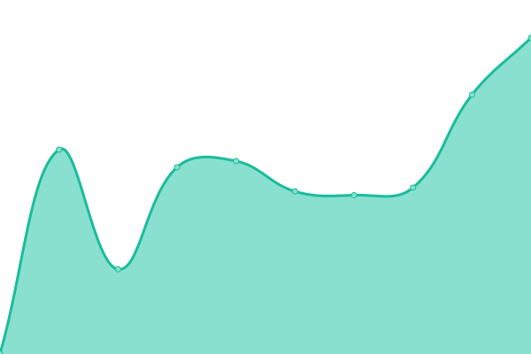
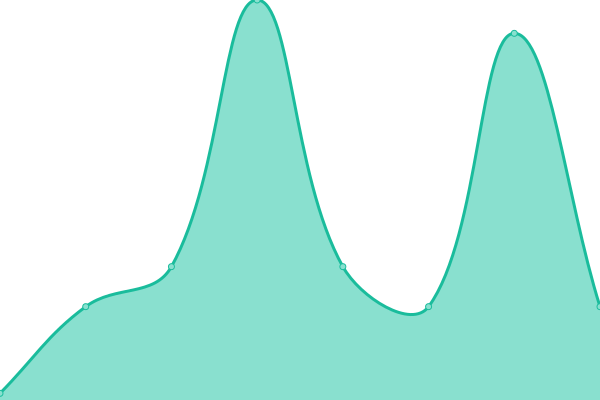

# [📈 Live Status](https://arturodc37.github.io/Service-Status-Check): <!--live status--> **🟧 Partial outage**

This repository contains the open-source uptime monitor and status page for [arturodc37](https://arturodc37.github.io/Service-Status-Check), powered by [Upptime](https://github.com/upptime/upptime).

With [Upptime](https://upptime.js.org), you can get your own unlimited and free uptime monitor and status page, powered entirely by a GitHub repository. We use [Issues](https://github.com/arturodc37/Service-Status-Check/issues) as incident reports, [Actions](https://github.com/arturodc37/Service-Status-Check/actions) as uptime monitors, and [Pages](https://arturodc37.github.io/Service-Status-Check) for the status page.

<!--start: status pages-->
<!-- This summary is generated by Upptime (https://github.com/upptime/upptime) -->
<!-- Do not edit this manually, your changes will be overwritten -->
<!-- prettier-ignore -->
| URL | Status | History | Response Time | Uptime |
| --- | ------ | ------- | ------------- | ------ |
|  [Avangenio](https://avangenio.com) | 🟩 Up | [avangenio.yml](https://github.com/arturodc37/Service-Status-Check/commits/HEAD/history/avangenio.yml) | 

 1121ms
     
 | 

<a href="https://arturodc37.github.io/Service-Status-Check/history/avangenio">34.74%</a>
    

|  [Cujae](https://cujae.edu.cu) | 🟥 Down | [cujae.yml](https://github.com/arturodc37/Service-Status-Check/commits/HEAD/history/cujae.yml) | 

 729ms
     
 | 

<a href="https://arturodc37.github.io/Service-Status-Check/history/cujae">95.61%</a>
    

|  [Correo](correo.avangenio.com) | 🟩 Up | [correo.yml](https://github.com/arturodc37/Service-Status-Check/commits/HEAD/history/correo.yml) | 

 34ms
     
 | 

<a href="https://arturodc37.github.io/Service-Status-Check/history/correo">100.00%</a>
    

<!--end: status pages-->

[**Visit our status website →**](https://arturodc37.github.io/Service-Status-Check)

## 📄 License

- Powered by: [Upptime](https://github.com/upptime/upptime)
- Code: [MIT](./LICENSE) © [Anand Chowdhary](https://anandchowdhary.com), supported by [Pabio](https://pabio.com)
- Data in the `./history` directory: [Open Database License](https://opendatacommons.org/licenses/odbl/1-0/)
